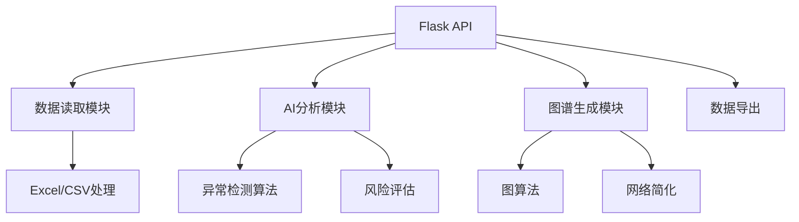
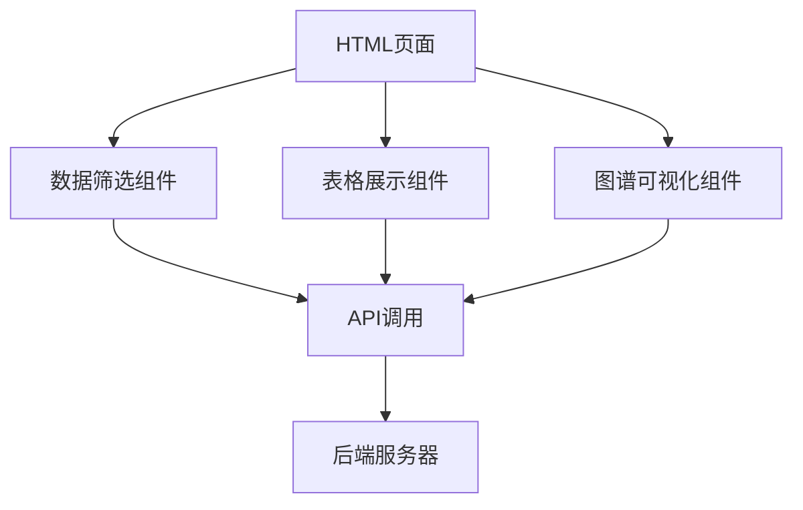

# 金融AI分析系统 - 求职作品集

一个基于 Flask 和 D3.js 的智能金融数据分析平台，集成机器学习和图算法，用于银行交易数据分析和洗钱风险监测。

## 项目亮点

### 🤖 AI 智能分析
- **机器学习风险检测** - 基于交易模式的异常检测算法
- **图神经网络** - 交易网络关系分析和循环交易模式识别
- **智能图谱简化** - 基于图论的节点重要性评估和网络简化

### 📊 数据可视化
- **交互式力导向图** - 实时渲染交易网络关系
- **动态数据表格** - 支持排序、筛选和分页
- **发票交易频率分析** - 基于D3.js的可视化图表

### 🔧 技术栈
- **后端**：Python 3.x, Flask 2.3.3, Pandas, NumPy
- **前端**：HTML5, CSS3, JavaScript, D3.js v7
- **数据处理**：Pandas数据清洗和预处理
- **算法**：图论算法, 异常检测, 网络分析

## 项目简介

本项目是一个专业的金融数据分析系统，集成了多种AI技术，提供以下核心功能：

- **智能风险检测** - 识别潜在的洗钱活动和异常交易
- **交易关系图谱** - 可视化展示账户间资金往来关系
- **发票图谱分析** - 分析销方和购方的发票往来
- **预警管理系统** - 智能预警生成和管理
- **多维度数据筛选** - 支持复杂条件组合筛选
- **数据导入导出** - 支持Excel文件处理

## 核心AI功能

### 1. 异常交易检测 (`analyze_money_laundering.py`)

**算法特性：**
- **无监督学习** - 基于统计方法的异常检测
- **多维度分析** - 金额、频率、时间、循环模式
- **实时处理** - 高效的数据流处理

**检测指标：**
- 大额交易分析（Top 5%）
- 频繁交易模式（高频交易者）
- 循环交易模式（A→B→A）
- 时间集中度分析（异常交易时间）

### 2. 智能图谱简化 (`simple.py`)

**算法特性：**
- **图论算法** - 基于节点度和中心性的网络简化
- **迭代优化** - 逐步移除非关键节点
- **源节点保护** - 保留核心交易节点

**功能：**
- 叶节点和孤立节点自动移除
- 网络密度优化
- 核心交易路径提取
- 实时图谱渲染

### 3. 数据智能处理

**特性：**
- **自动数据清洗** - 处理缺失值和异常数据
- **智能列匹配** - 自动识别数据字段
- **多格式支持** - Excel, CSV文件处理

## 项目结构

```
票务资金展示/
├── hou/                          # 后端服务目录
│   ├── app.py                    # Flask主应用服务器
│   ├── simple.py                 # 图谱简化算法（AI核心）
│   ├── analyze_money_laundering.py  # 风险分析脚本（AI核心）
│   ├── change.py                 # 数据变更处理
│   ├── index.py                  # 数据管理类
│   ├── note.py                   # 笔记记录功能
│   ├── read_excel.py             # Excel数据读取工具
│   ├── warning.py                # 预警处理模块
│   ├── big.py                    # 大数据处理
│   └── requirements.txt          # Python依赖包列表
├── qian/                         # 前端界面目录
│   ├── index.html                # 主数据展示页面
│   ├── filter.html               # 数据筛选和图谱页面
│   ├── detal.html                # 详情页面
│   └── d3.v7.min.js              # D3.js库文件
├── start.bat                     # Windows启动脚本
├── .gitignore                    # Git忽略配置
└── README.md                     # 项目说明文档
```

## 技术架构

### 后端架构



### 前端架构



## 安装与运行

### 环境要求
- Python 3.8+
- pip 包管理器

### 1. 克隆项目

```bash
git clone https://github.com/sdnbfdb/money-detect.git
cd 票务资金展示
```

### 2. 创建虚拟环境（推荐）

```bash
python -m venv .venv

# Windows
.venv\Scripts\activate

# macOS/Linux
source .venv/bin/activate
```

### 3. 安装依赖

```bash
cd hou
pip install -r requirements.txt
```

### 4. 运行项目

**方式一：使用启动脚本（Windows）**
```bash
# 在项目根目录下
start.bat
```

**方式二：手动启动**
```bash
cd hou
python app.py
```

### 5. 访问应用

打开浏览器访问：http://localhost:5000

## 主要功能演示

### 1. 数据筛选与分析

**功能：**
- 多维度条件组合筛选
- 实时数据表格展示
- 智能排序和分页

**使用场景：**
1. 设置筛选条件（户名、卡号、金额范围、时间范围）
2. 点击"应用筛选"查看结果
3. 浏览数据表格，支持排序和分页
4. 导出筛选结果到Excel

### 2. 交易关系图谱

**功能：**
- 力导向图可视化
- 节点拖拽和缩放
- 智能网络简化
- 实时交互

**使用场景：**
1. 筛选交易数据
2. 点击"查看往来图谱"
3. 探索账户间的交易关系
4. 分析资金流向和网络结构

### 3. 发票交易频率分析

**功能：**
- 发票交易频率统计
- 可视化图表展示
- 异常模式识别

**使用场景：**
1. 设置发票筛选条件
2. 点击"发票结点交易频率"
3. 查看发票交易模式分析

### 4. 智能风险检测

**功能：**
- 自动异常交易检测
- 风险等级评估
- 预警生成和管理

**使用场景：**
1. 系统自动分析交易数据
2. 识别异常交易模式
3. 生成风险预警
4. 查看预警详情和历史

## API 接口

### 数据接口

| 接口 | 方法 | 说明 |
|------|------|------|
| `/api/excel-data` | GET | 获取Excel数据 |
| `/api/filter-data` | POST | 筛选数据 |
| `/api/add-transaction` | POST | 添加交易记录 |
| `/api/add-invoice` | POST | 添加发票记录 |
| `/api/delete-transaction` | POST | 删除交易记录 |
| `/api/alerts` | GET/POST | 获取/添加预警 |
| `/api/export-data` | POST | 导出数据 |

### AI 分析接口

| 接口 | 方法 | 说明 |
|------|------|------|
| `/api/transaction-graph` | GET | 获取交易图谱数据 |
| `/api/invoice-graph` | GET | 获取发票图谱数据 |
| `/api/node-frequency` | GET | 获取节点交易频率 |
| `/api/analyze-risk` | POST | 风险分析 |
| `/api/simplify-graph` | POST | 图谱简化 |

## 技术亮点

### 1. 智能数据处理
- **自动数据清洗** - 处理缺失值和异常数据
- **智能字段匹配** - 自动识别数据列
- **高效数据转换** - 优化大数据处理性能

### 2. 先进的图算法
- **节点重要性评估** - 基于度中心性和介数中心性
- **网络简化优化** - 迭代式节点移除算法
- **实时图谱渲染** - 高效的D3.js力导向图实现

### 3. 异常检测技术
- **多维度异常识别** - 基于统计方法的异常检测
- **模式识别** - 循环交易和时间异常检测
- **风险评分** - 综合多指标的风险评估

### 4. 交互式可视化
- **实时响应** - 流畅的用户交互体验
- **自适应布局** - 响应式设计
- **丰富的交互功能** - 拖拽、缩放、悬停提示

## 项目价值

### 金融风控领域
- **提升风险识别能力** - 快速发现潜在洗钱活动
- **降低人工审核成本** - 自动化异常交易检测
- **提高分析效率** - 可视化工具辅助决策

### 技术展示
- **完整的前后端架构** - 全栈开发能力
- **AI算法应用** - 机器学习和图算法实践
- **数据可视化** - D3.js高级应用
- **工程化实践** - 模块化设计和代码规范

## 开发计划

### 未来功能
- [ ] **机器学习模型集成** - 基于历史数据训练预测模型
- [ ] **实时监控系统** - 流式数据处理和实时预警
- [ ] **多语言支持** - 国际化界面
- [ ] **移动端适配** - 响应式移动界面
- [ ] **更多数据源** - 支持数据库和API数据源

## 技术挑战与解决方案

### 1. 大数据处理
**挑战：** 处理大量交易数据时的性能问题
**解决方案：** 实现数据分块处理和内存优化

### 2. 图谱可视化性能
**挑战：** 大型网络的渲染性能
**解决方案：** 实现智能节点简化和层级渲染

### 3. 异常检测准确性
**挑战：** 减少误报和漏报
**解决方案：** 多维度指标综合评估和阈值优化

### 4. 系统可扩展性
**挑战：** 适应不同规模的数据和业务需求
**解决方案：** 模块化设计和插件架构

## 开发说明

### 代码规范
- **后端**：遵循PEP 8 Python编码规范
- **前端**：使用ES6+语法，保持代码简洁
- **文档**：详细的代码注释和API文档

### 测试建议
- **单元测试**：核心算法的单元测试
- **性能测试**：大数据处理性能测试
- **用户测试**：功能和用户体验测试

## 常见问题

### 1. 启动失败

**问题：** `ModuleNotFoundError: No module named 'flask'`

**解决：**
```bash
pip install -r hou/requirements.txt
```

### 2. 数据读取失败

**问题：** 页面显示"没有找到数据"

**解决：**
- 检查数据文件路径是否正确
- 确认Excel文件格式正确
- 查看后端控制台错误信息

### 3. 图谱渲染缓慢

**问题：** 大型网络渲染卡顿

**解决：**
- 使用图谱简化功能
- 减少显示的节点数量
- 优化浏览器性能

## 贡献指南

欢迎提交Issue和Pull Request！

1. Fork 本项目
2. 创建你的特性分支 (`git checkout -b feature/AmazingFeature`)
3. 提交你的更改 (`git commit -m 'Add some AmazingFeature'`)
4. 推送到分支 (`git push origin feature/AmazingFeature`)
5. 打开一个 Pull Request

## 许可证

本项目仅供学习交流使用。

## 联系方式

如有问题或建议，欢迎通过GitHub Issue联系。

---

**项目地址：** https://github.com/sdnbfdb/money-detect.git
**演示地址：** http://localhost:5000

*© 2026 金融AI分析系统 - 求职作品集*